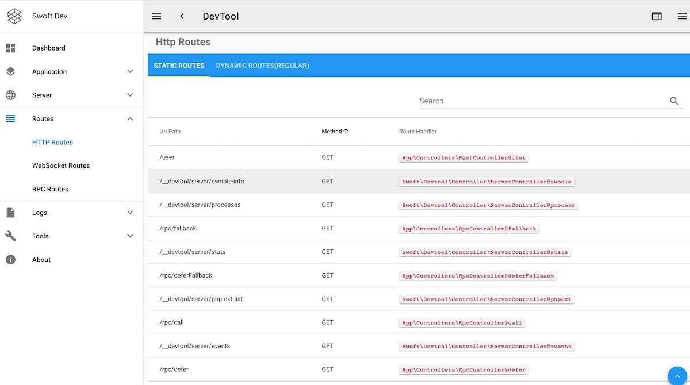

# swoft devtool

Dev tool for swoft

## Install

- composer command

```bash
composer require swoft/devtool
```

## Quick start

1. Add http middleware in `config/beans/base.php`

```php
'serverDispatcher' => [
      'middlewares' => [
          // ...
          \Swoft\Devtool\Middleware\DevToolMiddleware::class,
      ]
  ],
```

2. Some optional config for devtool(in `config/properties/app.php`).

```php
'devtool' => [
    'enable' => true,
    'logEventToConsole' => true,
    'logHttpRequestToConsole' => true,
],
```

3. Publish static assets to `public` dir.

```bash
php bin/swoft dev:publish swoft/devtool
// -f will delete old assets.
php bin/swoft dev:publish swoft/devtool -f
```

4. Now, you can access `HOST:PORT/__devtool` by browser. e.g `http://127.0.0.1:9088/__devtool`

5. If you see the following screen, you have successfully installed



## Question

If you cannot access the address `HOST:PORT/__devtool`

- Ensure your static assets is can accessed and assets is publish successful.
- Ensure that the server was restarted after updating the package

## Notice

Opening devTool will have some impact on server operation, please turn it off during stress test.

## Document

Please see [document site](https://doc.swoft.org)

## Unit testing

```bash
phpunit
```

## LICENSE

The Component is open-sourced software licensed under the [Apache license](LICENSE).

